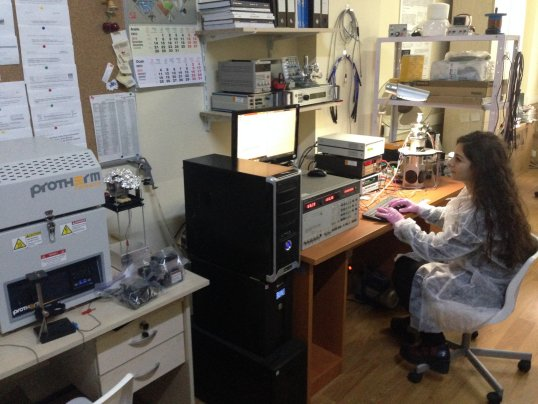
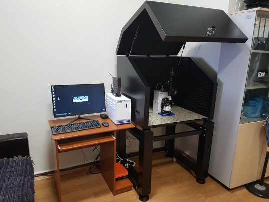
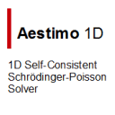

## Facilities

We are studying in both experimentally and numerically. You may found more information about our facilities below.

### Experimental Studies

#### Chemical Vapor Deposition System

We have an Ultrasonic Spray Chemical Vapor Deposition with Remote Spark Plasma Generator for Ozone generation for growth of ZnO, MgZnO and their heterostructures.

In additional to our ZnO system, we have a small Graphene CVD system.

#### Electrical Characterization Laboratory

Most of the research activities in the wide band gap (WBG) materials and HEMT devices are carried out in this laboratory where experimental facilities exists to investigate electrical properties of semiconductors between 77K and 300K. The experimental sets include I/V, electrical transport, and hot electron (high voltage pulse measurements).

#### Atomic Force Microscopy (AFM) System

We have an AFM system for structural investigations. Our compact, tabletop AFM system has all the important features and benefits expected from a light lever AFM and includes everything required for high-resolution scanning. It has a passive vibration prevention system.

Sample Sizes:	Up to 1" X 1" X 3/4"
Standard Scanning Modes:	Vibrating(Tapping), Non Vibrating (Contact), Phase, LFM
Scanners:	50 x 50 x 17 µm, 15 x 15 x 7 µm
Video Optical Microscope:	Zoom to 400X, 2 µm resolution
Stage and EBox Size:	Compact table top design, with passive vibration prevention cabin.

### Computational Studies

#### Device Simulations
 

* **TiberCad:** Multiscale 3D nano device simulator,
* **Aestimo 1D:** Open-source 1D nano device simulator,

#### Density Functional Theory Studies
  

* **QuantumWise ATK:**First-principles simulation software for nanoscience,
* **CASTEP:** is a full-featured materials modelling code based on a first-principles quantum mechanical description of electrons and nuclei.
* **FHI-Aims:** is an efficient, accurate all-electron, full-potential electronic structure code package .
