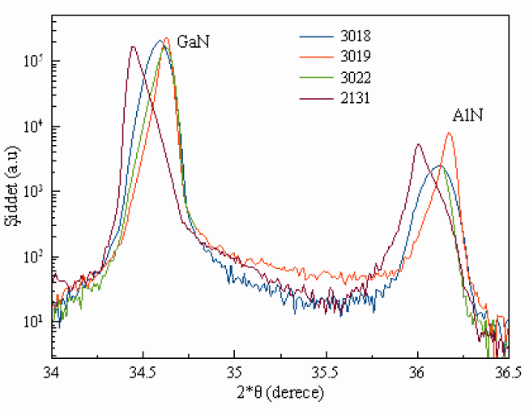
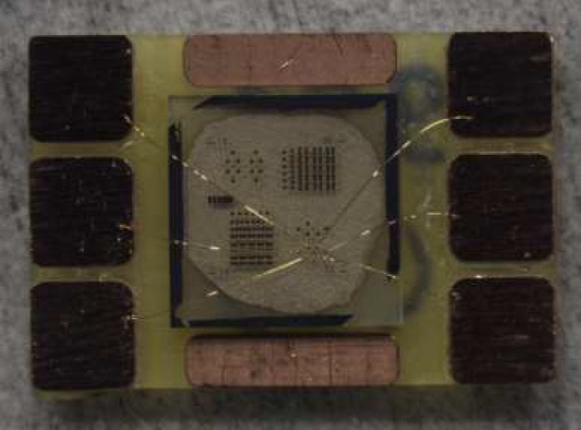
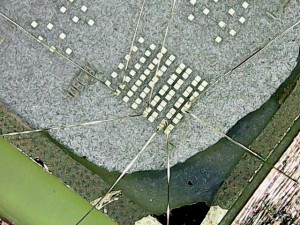

## Projects
### High-Performance Modelling and Experimental Investigation of Transport and Device Properties of GaN-based High Electron Mobility Transistors with Ultrathin Barriers

*TUBITAK 3001 Project*

Sample Image| Abstract
 ---- | ----
  | In this study, ultra-thin barrier HEMTs will be designed for different configurations including polarization, voltage and temperature variations, with solving the high-performance self-consistent 1-dimensional Schrödinger-Poisson equations. Band structure, carrier density, and strain distributions are calculated. After design and modelling, the best structures are grown with Metal Organic Chemical Vapor Deposition (MOCVD) method. After, the electrical properties (Hall), and structural properties (Atomic force microscopy, X-Ray Diffraction) of these grown structures are measured. Results are enlighthened us to better understand ultra-thin barrier HEMT structures and result to look forward for producing transistors without the short-channel effects. 

### Modification of properties of two-dimensional electronic gas using in situ surface passivation of AlGaN/GaN heterostructures by molecular beam epitaxy

*Joint grant of Scientific and Technological Research Council of Turkey and RFBR of Russia, TUBITAK 2532 Project*

Sample Image| Abstract
 ---- | ----
  | In this project, the effect of in situ grown Si3N4  passivation on electrical, optical and structural properties of 2DEG including AlGaN/GaN structures were investigated in details. For the characterization, Hall effect, quantum Hall effect, high-speed pulse high electric field measurements, Raman, atomic force microscopy, x-ray diffraction and photoluminescence measurements were taken and analyzed. In addition to these experimental methods, the effect of several impurities on electronic and optical properties of Si3N4  material was investigated with density functional theory. In addition, some transistor parameters of high power transistors with Si3N4 passivation with impurities were calculated with device simulations. 

## Wide Band-gap Materials

### GaN-based heterostructures (AlGaN/GaN, InAlN/GaN etc.)
* Improvement of two dimensional electron gas (2DEG) well parameters
* Experimental investigation of electron transport, magnetotransport, hot-electron transport properties
* Investigation of effect of Si3N4 surface passivation
* InGaN/GaN multi-quantum wells (MQWs)
* Band engineering; High Electron Mobility Transistor (HEMT) device design and modeling

### ZnO-based heterostructures (MgZnO/ZnO, BeZnO/ZnO etc.)
* Improvement of 2DEG well parameters
* Development of hybrid GaN/ZnO heterostructures
* Band engineering; device design and modeling

## Two Dimensional Materials

### Graphene and other 2D structures
* Graphene based transistors
* Investigation of magnetoconductivity and surface properties of exfoliated and epitaxially grown graphene samples
* Investigation of scattering mechanisms in epitaxially graphene on SiC substrate
* Investigation of structural, electronic and optical properties in graphene nanoribbons
* Investigation of structural, electronic and optical properties of 2D black phosphorus

